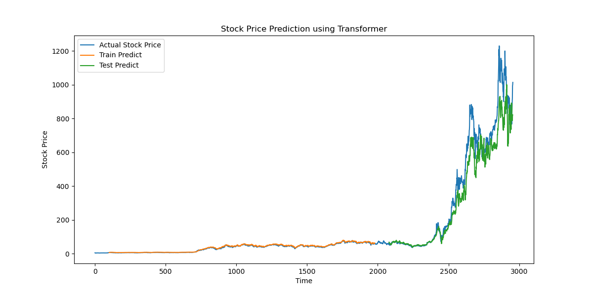

# Stock Price Prediction using Transformers

This project demonstrates how to predict stock prices using a Transformer model implemented with TensorFlow. It focuses on predicting Tesla's stock prices but can be adapted for any stock by changing the dataset.

## Project Overview

The project uses a simplified Transformer architecture to forecast stock prices based on historical price data. It includes data loading, preprocessing, model training, prediction, and evaluation phases, with an emphasis on understanding the Transformer's application in time series forecasting.

## Requirements

To run this project, you need the following libraries:
- TensorFlow
- Pandas
- NumPy
- Scikit-learn
- Matplotlib

You can install these dependencies via pip:

```bash
pip install tensorflow pandas numpy scikit-learn matplotlib
```

## Dataset
The dataset used in this project is Tesla's stock prices obtained from a CSV file named `TSLA.csv`. The CSV file should contain daily stock prices with at least the following columns: `Date`, `Open`, `High`, `Low`, `Close`, `Volume`.

## Usage
1.**Data Preparation:** Place your TSLA.csv file in the project directory.
2.**Model Training:** Run the provided Python script to train the Transformer model on the stock price data.
3.**Evaluation and Visualization**: The script will evaluate the model's performance using RMSE and generate plots to visually compare the actual and predicted stock prices.
## Code Structure
- **Data Loading and Preprocessing**: The script starts by loading the Tesla stock price data from a CSV file, focusing on the `Close` prices. The data is then normalized using `MinMaxScaler`.
- **Creating Sequences**: A helper function `create_dataset` is used to create sequences from the time series data, which are used as input for the model.
- **Model Creation**: Defines a Transformer model using TensorFlow, focusing on key components like LayerNormalization and MultiHeadAttention.
- **Training**: The model is trained on the preprocessed dataset.
- **Prediction and Evaluation**: The script predicts stock prices on the training and test datasets and evaluates the model's performance using RMSE.
- **Visualization**: Finally, the actual vs. predicted prices are plotted using matplotlib.

## Results
After running the script, you will see a plot comparing the actual Tesla stock prices with the predictions made by the Transformer model. The console will also display the RMSE values for both the training and test datasets.


## Customization
You can customize the dataset, model architecture, and training parameters to predict other stocks or improve the model's accuracy.

## License
This project is open-source and available under the MIT license.
